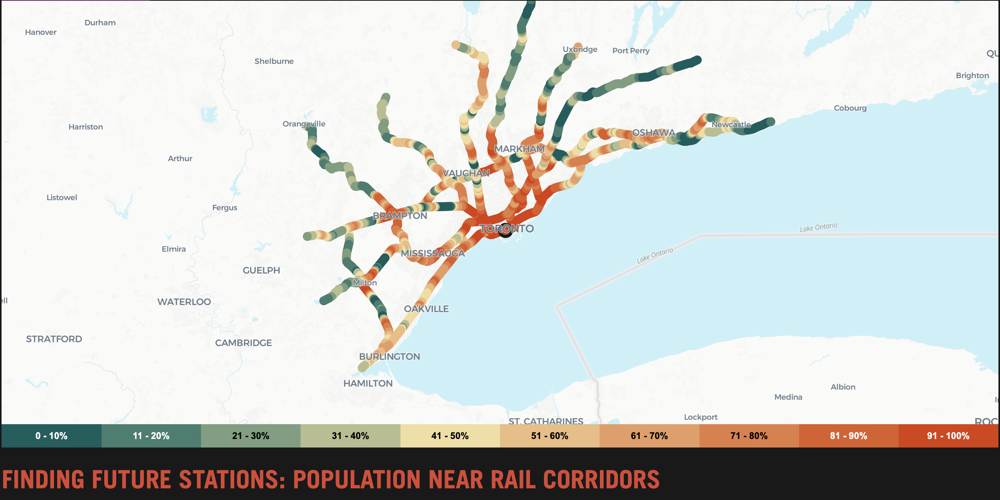

# <b>Population Living Near Rail Corridors </b>

This is a data visualization project to show the number of people living near exiting rail corridors  

## Why Make This Map?

Sometimes when I open Google Maps, I get distracted by the extensive network of rail tracks that run through Toronto. Every time this happens, I find myself thinking, “How nice would it be to have a station here… and here… and here…” (and another 20 minutes of this). I’ve also heard many people say that the rail line running through midtown Toronto would be ideal for an east–west rail service in Toronto. Given new transit lines are time consuming and expensive to build, is there a way for the GTA to leverage existing railway infrastructure to increase transit capacity? That question led me to explore: How many people live within 1 km of our existing rail tracks in the Greater Toronto Area? The findings suggest that there are many locations with great potential for adding new stations. Even in areas with lower residential populations, nearby industrial lands could attract a significant number of workers who might benefit from having a station in the area (this is my best guess, since I don’t have access to spatial employment data across the GTA). One caveat, however, is that I’m not a transportation expert—there are many other factors that need to be considered when assessing the feasibility of a station location  In my mind, these trains don’t have to be long. They could be something like Montreal’s REM or Vancouver’s skyTrain, serving at medium-capacity, automated, and frequent. The existing GO trains could then function as express services, similar to the express trains we see on the Lakeshore West Line today.

<strong>Link to the Web Map</strong>
https://chunfuliu.github.io/gta-rail-corridor-new-stations/

